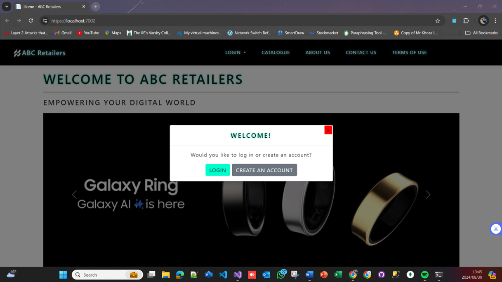
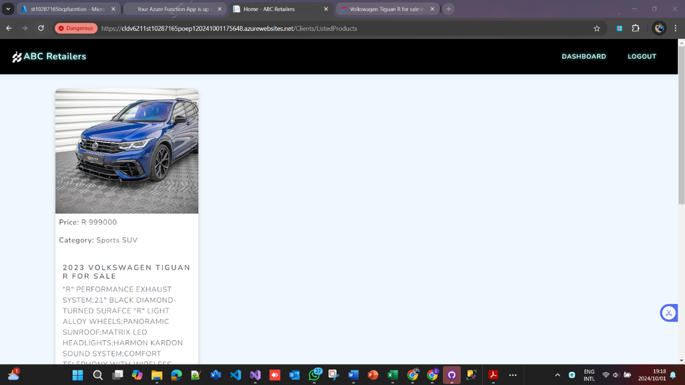
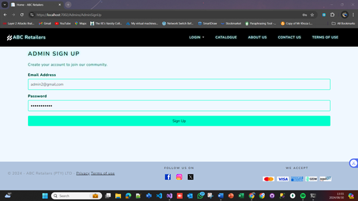
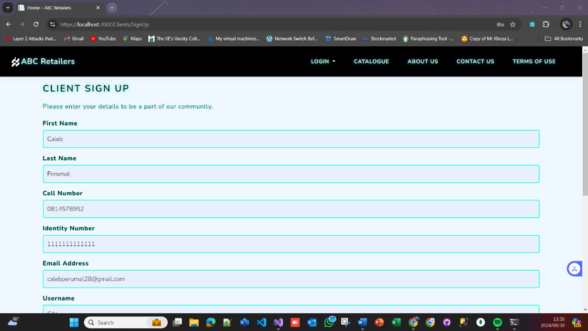
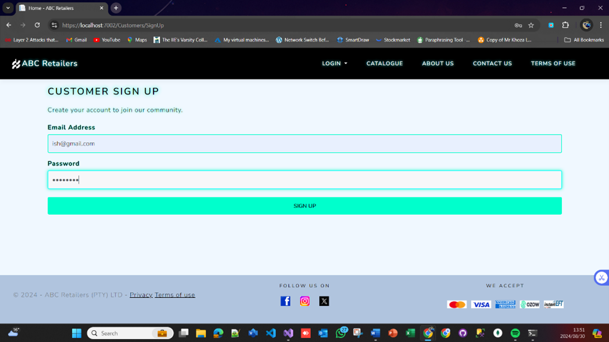
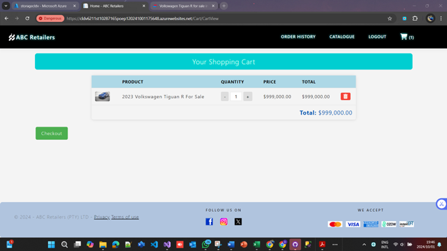
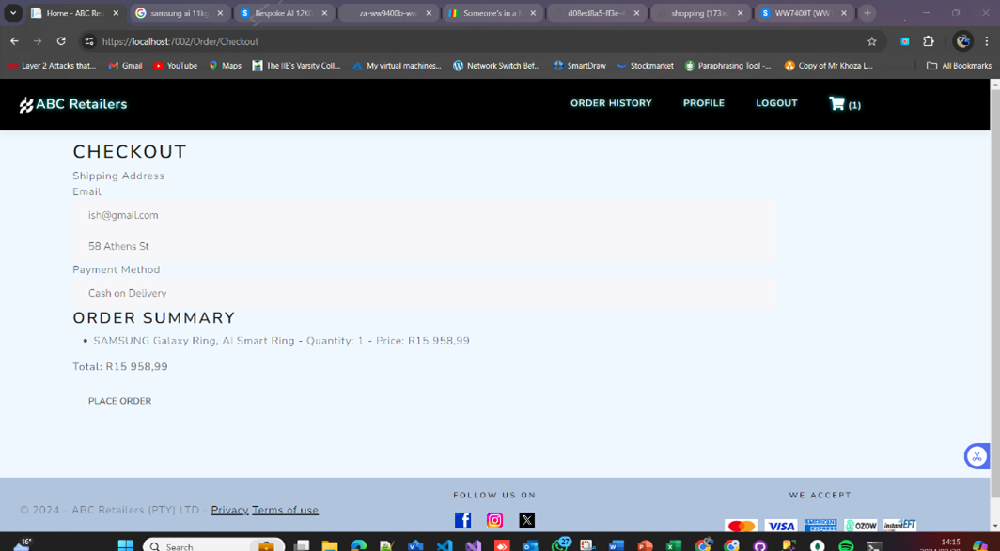
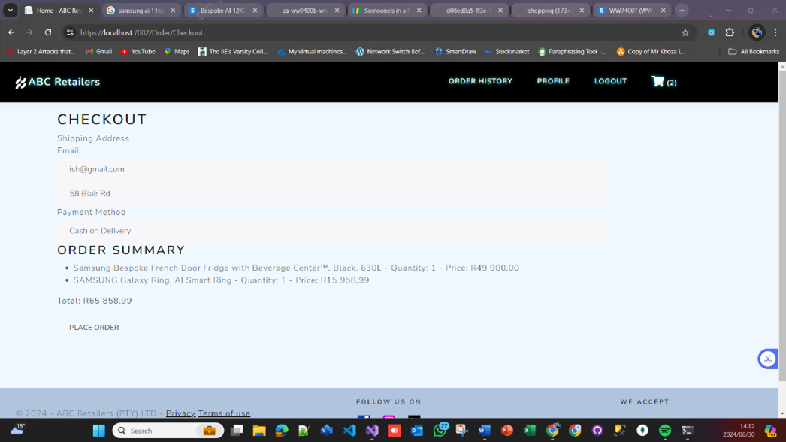
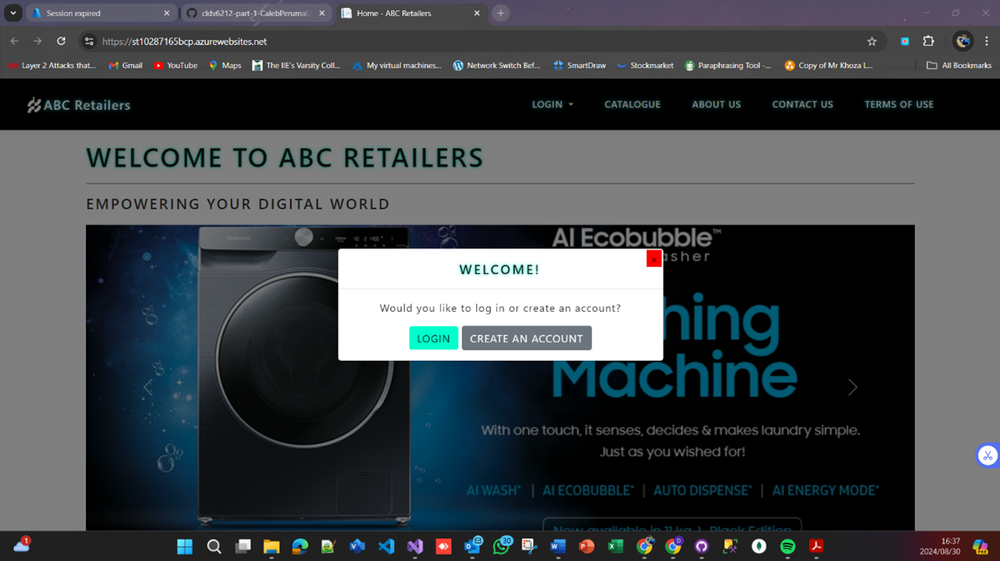

<div align="center">

<h1>🛠️☁️ ABC Retailers – Part 2 Azure Functions ☁️🛠️</h1>

<h2></h2>

</div>

---
**👤 Name:** Braden Caleb Perumal  
**🎓 Student Number:** ST10287165  

---

## 📑 Contents
- 📖 Introduction  
- ⚙️ Requirements  
- 📝 How to Apply  
- 🛍️ Application Overview  
- 🏗️ Architecture  
- 🚀 Functionality  
- 📊 Non-Functional Requirements  
- 🗂️ Change Log  
- ❓ FAQs  
- 🖥️ How to Use  
- 📜 Licensing  
- 🧩 Plugins  
- 🙌 Credits  
- 🌐 GitHub Link  
- 🎥 Screenshots 
- 🔑 Admin Login Credentials  
- 📚 References  

---

## 1) Introduction
ABC Retailers – Part 2 & 3 extends the Part 1 application with **Azure cloud integration**, **serverless Azure Functions**, and additional functionality for scalability, automation, and improved user experience.  
The system now supports **file uploads to Azure Blob Storage**, **automated processing with Azure Functions**, and **enhanced checkout workflows** integrated with cloud services.

---

## 2) Requirements
- .NET 6.0 SDK or higher  
- Microsoft SQL Server (Express or Full)  
- Visual Studio 2022  
- Entity Framework Core Tools  
- Azure Subscription (Blob Storage, Functions, Table Storage)  
- Git (version control)  

### 🛠 Sample `appsettings.json` Configuration:
```json
{
  "ConnectionStrings": {
    "CLDV6211_ST10287165_POE_P1Context": "Server=YOUR_SERVER;Database=ABCRetailersDb;Trusted_Connection=True;MultipleActiveResultSets=true",
    "AzureStorage": "DefaultEndpointsProtocol=https;AccountName=YOUR_ACCOUNT;AccountKey=YOUR_KEY;EndpointSuffix=core.windows.net"
  },
  "FunctionUrl": "https://YOUR_FUNCTION_APP.azurewebsites.net/api/",
  "Logging": {
    "LogLevel": {
      "Default": "Information",
      "Microsoft.AspNetCore": "Warning"
    }
  },
  "AllowedHosts": "*"
}

```
> ⚠ **Important Setup Instructions**  
> 
> 1. 📤 **Publish your Azure Function** to your Azure Subscription.  
> 2. 🔗 **Copy the Function URL** from the Azure Portal and set it in the `"FunctionUrl"` field in `appsettings.json`.  
> 3. 🔐 **Replace `"AzureStorage"`** with your actual Azure Storage connection string (AccountName + AccountKey).  
> 4. 🚫 **Do not commit real keys to GitHub** — store them in a local `.env` file or in **Azure App Service Configuration Settings** for production.

---

## 3) How to Apply
1. Clone this repository or download the ZIP.  
2. Open the project folder in **Visual Studio 2022**.  
3. Run `dotnet restore` to restore dependencies.  
4. Update the SQL and Azure connection strings in `appsettings.json`.  
5. Apply migrations:  
   ```bash
   dotnet ef database update
   ```
6. Deploy Azure Functions via Visual Studio or Azure Portal.  
7. Run the application:  
   ```bash
   dotnet run
   ```

---

## 4) Application Overview
**Purpose:**  
To enhance ABC Retailers' system with cloud-hosted, serverless functionality for image storage, processing, and order workflows.

**Key Additions in Part 2 & 3:**
- Azure Blob Storage for product images.  
- Azure Functions for automated file handling and order processing.  
- Improved checkout process with asynchronous background processing.

---

## 5) Architecture
The updated architecture includes:
- **ASP.NET Core MVC** web app for user interaction.  
- **Azure Blob Storage** for storing product images.  
- **Azure Table Storage** for storing product, order, and customer data.  
- **Azure Functions** to process image uploads and handle order-related background tasks.  

---

## 6) Functionality

### Admin:
- Manage products with image uploads to Azure Blob Storage.  
- View and manage customers.  
- Process orders (with Azure Function triggers).  

### Customer:
- Register, browse, and order products.  
- View images loaded from Azure Blob Storage.  

### Cloud Processing:
- Automatic image resizing and validation via Azure Functions.  
- Order confirmation messaging using Azure Queue and Function processing.

---

## 7) Non-Functional Requirements
- **Security:** Azure role-based access for storage; hashed passwords for user accounts.  
- **Performance:** Cloud-based scaling for storage and processing tasks.  
- **Scalability:** Azure serverless functions handle load spikes without infrastructure changes.  
- **Reliability:** Blob storage redundancy and Azure SLA-backed uptime.  
- **Usability:** Seamless integration between cloud storage and application UI.  

---

## 8) Change Log
**v2.0.0 – Part 2 Update**  
- ✅ Integrated Azure Blob Storage for product images  
- ✅ Added Azure Function for file processing  
- ✅ Connected Azure Table Storage for additional entity storage  
- ✅ Updated product management to support cloud file uploads  

**v3.0.0 – Part 3 Update**  
- ✅ Implemented Azure Queue Storage for order confirmations  
- ✅ Added Azure Function to process checkout queue messages  
- ✅ Enhanced checkout flow with pending → confirmed order status  
- ✅ Improved performance and scalability via serverless architecture  

---

## 9) FAQs
**Q1:** Do I need an Azure subscription to run this?  
**A1:** Yes. You must configure Azure services (Blob, Table, Functions) before deploying.

**Q2:** Can I run locally without Azure?  
**A2:** Yes, but cloud-based features will be disabled.

**Q3:** Is order processing instant?  
**A3:** Order confirmations are processed asynchronously through Azure Functions.

---

## 10) How to Use
1. Configure Azure services in `appsettings.json`.  
2. Deploy Azure Functions to your subscription.  
3. Run the MVC application locally or deploy to Azure App Service.  
4. Use the Admin portal to manage products and customers.  
5. Place orders via the Customer interface.

---

## 11) Licensing
ABC Retailers is licensed under the MIT License. You are free to use, modify, and distribute the project with proper credit.

---

## 12) Plugins
- Entity Framework Core  
- ASP.NET Identity  
- Azure.Storage.Blobs  
- Azure.Data.Tables  
- Azure.Storage.Queues  

---

## 13) Credits
This project was created and maintained by **Braden Caleb Perumal (ST10287165)**.

---

## 14) GitHub Link
https://github.com/YourUsername/abc-retailers-part2-3

---

## 15)  📸 Screenshots

### 🏠 Home Page & 🛍️ Product Catalog
<p align="center">
  <div align="center">
    <p><strong>🏠 Home Page</strong></p>
    
  </div>
  <div align="center">
    <p><strong>🛍️ Product Catalog</strong></p>
    
  </div>
</p>

### ➕ Add Product & 🛡️ Admin Sign-Up
<p align="center">
  <div align="center">
    <p><strong>➕ Add Product</strong></p>
    
  </div>
  <div align="center">
    <p><strong>🛡️ Admin Sign-Up</strong></p>
    
  </div>
</p>

### 👤 Client Sign-Up & 👤 Customer Sign-Up
<p align="center">
  <div align="center">
    <p><strong>👤 Client Sign-Up</strong></p>
    
  </div>
  <div align="center">
    <p><strong>👤 Customer Sign-Up</strong></p>
    
  </div>
</p>

### 🛒 Cart & 💳 Checkout
<p align="center">
  <div align="center">
    <p><strong>🛒 Shopping Cart</strong></p>
    
  </div>
  <div align="center">
    <p><strong>💳 Checkout</strong></p>
    
  </div>
</p>

### ✅ Order Confirmation & 📦 Order Details
<p align="center">
  <div align="center">
    <p><strong>✅ Order Confirmation</strong></p>
    
  </div>
  <div align="center">
    <p><strong>📦 Order Details</strong></p>
    
  </div>
</p>

### ☁️ Hosted Deployment View
<p align="center">
  <div align="center">
    <p><strong>☁️ Hosted Deployment View</strong></p>
    
  </div>
</p>


---

## 16) Admin Login Credentials
> ⚠️ **Note:** For demonstration purposes, the **Admin** can create an account and log in directly.  
> This is **not** a production practice — in a real deployment, accounts will be seeded and roles properly assigned.

---

## 17) References
- BroCode. C# Full Course. [YouTube](https://www.youtube.com/watch?v=wxznTygnRfQ)  
- BroCode. C# for Beginners. [YouTube](https://www.youtube.com/watch?v=r3CExhZgZV8)  
- Microsoft Docs. Azure Blob Storage Overview. [https://learn.microsoft.com/azure/storage/blobs/](https://learn.microsoft.com/azure/storage/blobs/)  
- Microsoft Docs. Azure Functions Overview. [https://learn.microsoft.com/azure/azure-functions/](https://learn.microsoft.com/azure/azure-functions/)  
- GeeksforGeeks. C# Constructors. [https://www.geeksforgeeks.org/c-sharp-constructors/](https://www.geeksforgeeks.org/c-sharp-constructors/)  
